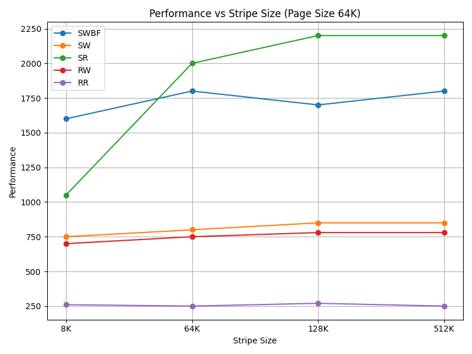
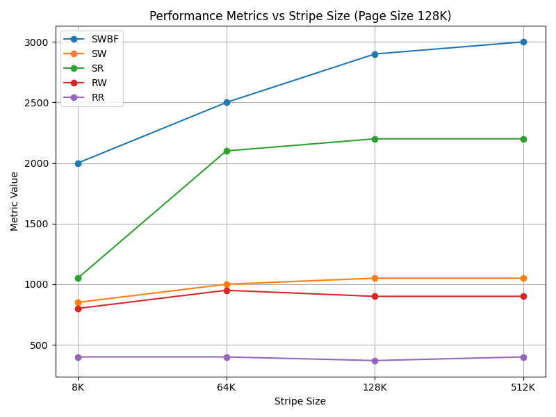
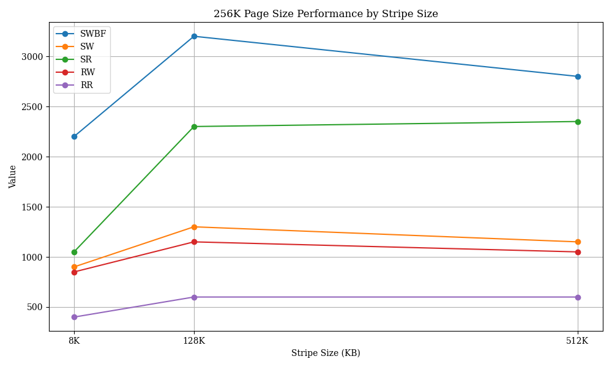
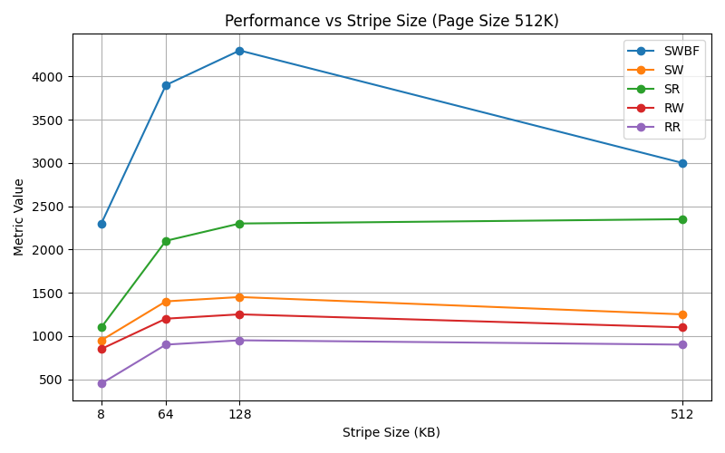
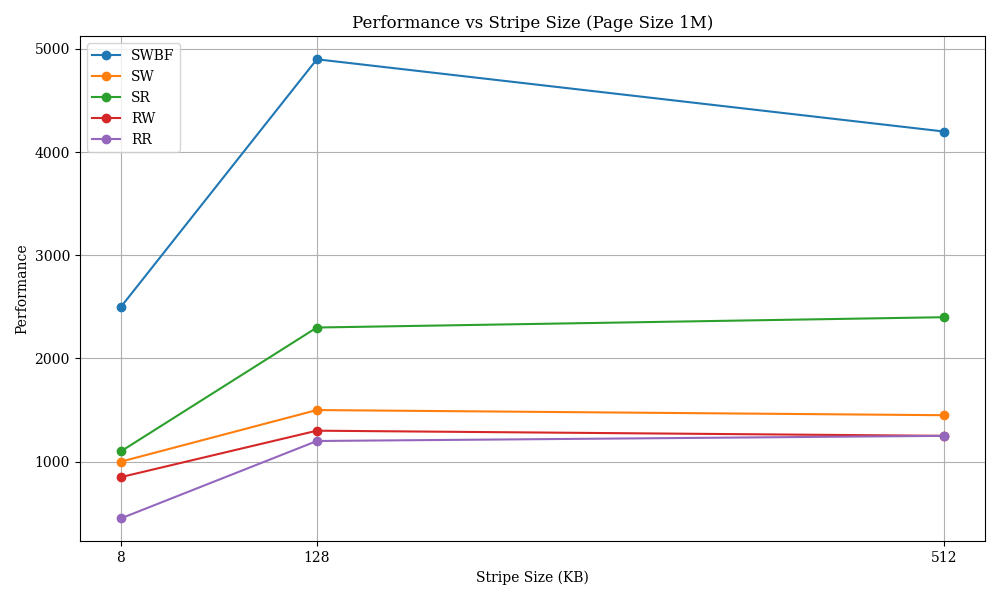

SWBF: seq_write_buf_fsync

SW: seq_write_direct

SR: seq_read_direct

RW: rand_write_direct

RR: rand_read_direct

unit: MB/s

no raid0 perf:
| Page Size | Metric | Throughput|
|-----------|--------|-----------|
| 8K        | SWBF   | 500       |
| 8K        | SW     | 360       |
| 8K        | SR     | 1000      |
| 8K        | RW     | 340       |
| 8K        | RR     | 55        |

| Page Size | Metric | 8K Stripe | 64K Stripe  | 128K Stripe | 512K Stripe |
|-----------|--------|-----------|-------------|-------------|-------------|
| 8K        | SWBF   | 460       | 470         | 430         | 480         |
| 8K        | SW     | 270       | 275         | 275         | 290         |
| 8K        | SR     | 1000      | 1650        | 1800        | 1900        |
| 8K        | RW     | 270       | 270         | 250         | 270         |
| 8K        | RR     | 50        | 50          | 60          | 50          |

| Page Size | Metric | 8K Stripe | 64K Stripe  |128K Stripe  | 512K Stripe |
|-----------|--------|-----------|-------------|-------------|-------------|
| 16K       | SWBF   | 800       | 950         | 750         | 850         |
| 16K       | SW     | 450       | 450         | 420         | 430         |
| 16K       | SR     | 1050      | 1900        | 2000        | 2000        |
| 16K       | RW     | 420       | 400         | 400         | 400         |
| 16K       | RR     | 90        | 90          | 100         | 90          |

| Page Size | Metric | 8K Stripe | 64K Stripe  | 128K Stripe | 512K Stripe |
|-----------|--------|-----------|-------------|-------------|-------------|
| 32K       | SWBF   | 1150      | 1350        | 1250        | 1350        |
| 32K       | SW     | 650       | 650         | 630         | 650         |
| 32K       | SR     | 1050      | 2050        | 2150        | 2150        |
| 32K       | RW     | 600       | 600         | 580         | 580         |
| 32K       | RR     | 160       | 160         | 170         | 160         |

| Page Size | Metric | 8K Stripe | 64K Stripe  | 128K Stripe | 512K Stripe |
|-----------|--------|-----------|-------------|-------------|-------------|
| 64K       | SWBF   | 1600      | 1800        | 1700        | 1800        |
| 64K       | SW     | 750       | 800         | 850         | 850         |
| 64K       | SR     | 1050      | 2000        | 2200        | 2200        |
| 64K       | RW     | 700       | 750         | 780         | 780         |
| 64K       | RR     | 260       | 250         | 270         | 250         |

| Page Size | Metric | 8K Stripe | 64K Stripe  | 128K Stripe | 512K Stripe |
|-----------|--------|-----------|-------------|-------------|-------------|
| 128K      | SWBF   | 2000      | 2500        | 2900        | 3000        |
| 128K      | SW     | 850       | 1000        | 1050        | 1050        |
| 128K      | SR     | 1050      | 2100        | 2200        | 2200        |
| 128K      | RW     | 800       | 950         | 900         | 900         |
| 128K      | RR     | 400       | 400         | 370         | 400         |

| Page Size | Metric | 8K Stripe | 64K Stripe  | 128K Stripe | 512K Stripe |
|-----------|--------|-----------|-------------|-------------|-------------|
| 256K      | SWBF   | 2200      | 2600        | 3200        | 2800        |
| 256K      | SW     | 900       | 1100        | 1300        | 1150        |
| 256K      | SR     | 1050      | 2100        | 2300        | 2350        |
| 256K      | RW     | 850       | 950         | 1150        | 1050        |
| 256K      | RR     | 400       | 400         | 600         | 600         |

| Page Size | Metric | 8K Stripe | 64K Stripe  | 128K Stripe | 512K Stripe |
|-----------|--------|-----------|-------------|-------------|-------------|
| 512K      | SWBF   | 2300      | 3900        | 4300        | 3000        |
| 512K      | SW     | 950       | 1400        | 1450        | 1250        |
| 512K      | SR     | 1100      | 2100        | 2300        | 2350        |
| 512K      | RW     | 850       | 1200        | 1250        | 1100        |
| 512K      | RR     | 450       | 900         | 950         | 900         |

| Page Size | Metric | 8K Stripe | 64K Stripe  | 128K Stripe | 512K Stripe |
|-----------|--------|-----------|-------------|-------------|-------------|
| 1M        | SWBF   | 2500      |  4300       | 4900        | 4200        |
| 1M        | SW     | 1000      |  1400       | 1500        | 1450        |
| 1M        | SR     | 1100      |  2150       | 2300        | 2400        |
| 1M        | RW     | 850       |  1250       | 1300        | 1250        |
| 1M        | RR     | 450       |  900        | 1200        | 1250        |
