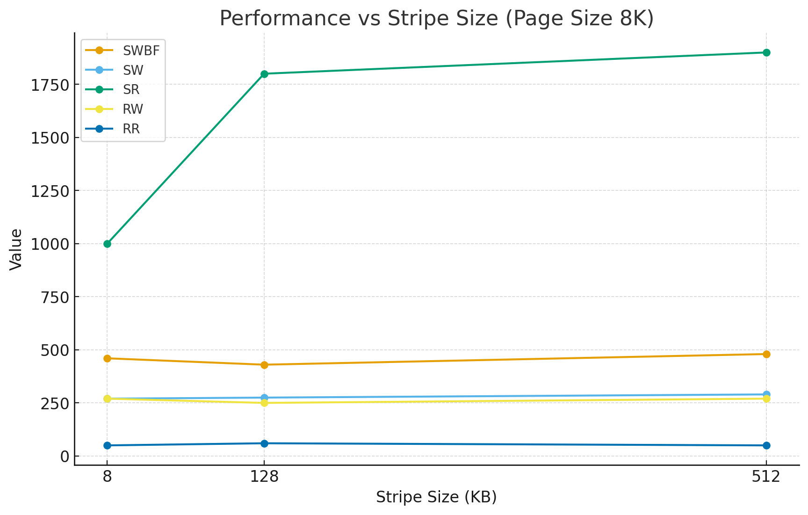
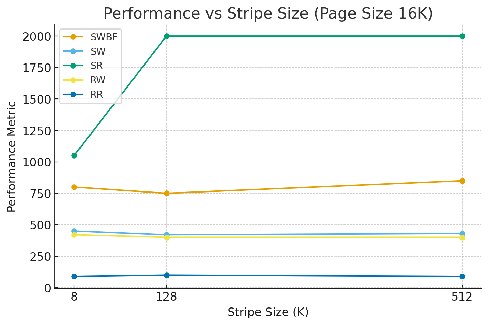
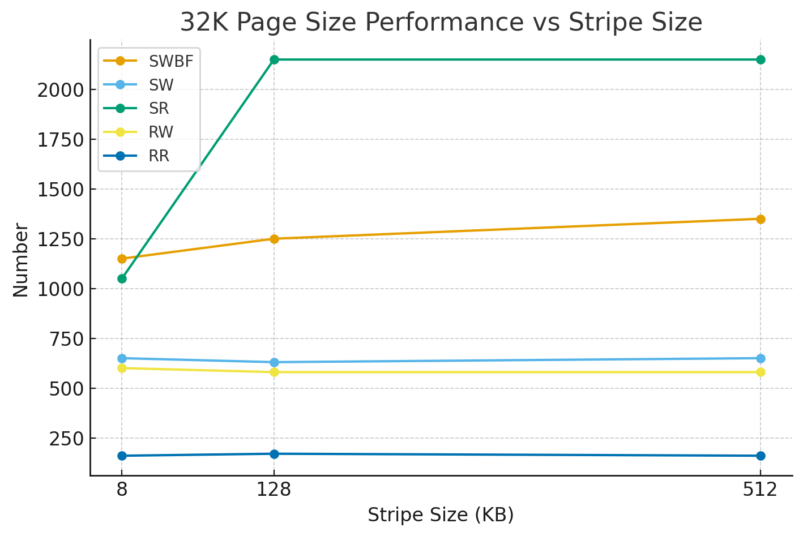

SWBF: seq_write_buf_fsync

SW: seq_write_direct

SR: seq_read_direct

RW: rand_write_direct

RR: rand_read_direct

unit: MB/s

| Page Size | Metric | 8K Stripe | 128K Stripe | 512K Stripe |
|-----------|--------|-----------|-------------|-------------|
| 8K        | SWBF   | 460       | 430         | 480         |
| 8K        | SW     | 270       | 275         | 290         |
| 8K        | SR     | 1000      | 1800        | 1900        |
| 8K        | RW     | 270       | 250         | 270         |
| 8K        | RR     | 50        | 60          | 50          |

| Page Size | Metric | 8K Stripe | 128K Stripe | 512K Stripe |
|-----------|--------|-----------|-------------|-------------|
| 16K       | SWBF   | 800       | 750         | 850         |
| 16K       | SW     | 450       | 420         | 430         |
| 16K       | SR     | 1050      | 2000        | 2000        |
| 16K       | RW     | 420       | 400         | 400         |
| 16K       | RR     | 90        | 100         | 90          |

| Page Size | Metric | 8K Stripe | 128K Stripe | 512K Stripe |
|-----------|--------|-----------|-------------|-------------|
| 32K       | SWBF   | 1150      | 1250        | 1350        |
| 32K       | SW     | 650       | 630         | 650         |
| 32K       | SR     | 1050      | 2150        | 2150        |
| 32K       | RW     | 600       | 580         | 580         |
| 32K       | RR     | 160       | 170         | 160         |
