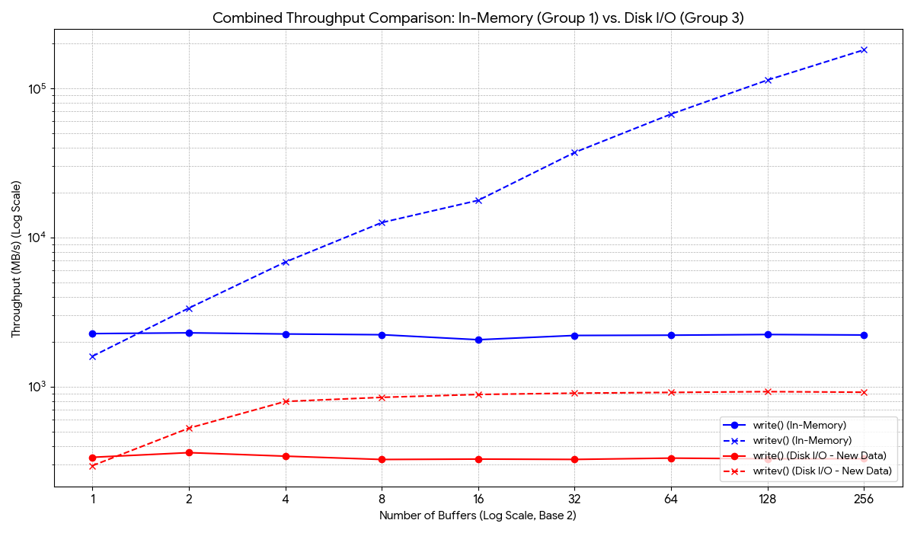

## write vs writev with/out disk

## Throughput Data: write() vs. writev() (GB/s) 1KB writing unit

| Buffers | write() In-Memory (GB/s) | writev() In-Memory (GB/s) | write() Disk I/O (GB/s) | writev() Disk I/O (GB/s) |
| :---: | :---: | :---: | :---: | :---: |
| 1 | 2.218 | 1.563 | 0.329 | 0.289 |
| 2 | 2.244 | 3.289 | 0.353 | 0.515 |
| 4 | 2.205 | 6.692 | 0.335 | 0.779 |
| 8 | 2.180 | 12.305 | 0.318 | 0.829 |
| 16 | 2.018 | 17.340 | 0.320 | 0.867 |
| 32 | 2.155 | 36.330 | 0.318 | 0.885 |
| 64 | 2.164 | 65.629 | 0.325 | 0.895 |
| 128 | 2.187 | 110.973 | 0.321 | 0.906 |
| 256 | 2.171 | 176.913 | 0.322 | 0.898 |
