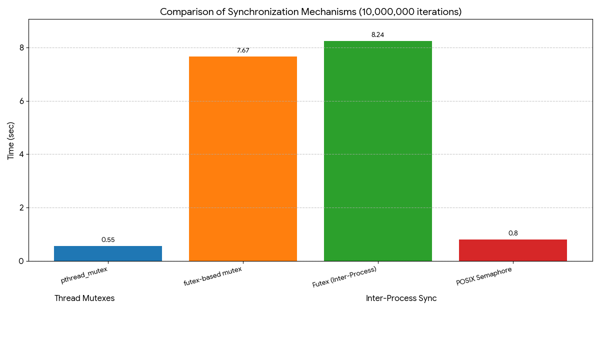

## futex vs pthread vs semaphore Benchmark

Comparing pthread_mutex vs futex-based mutex (10000000 iterations)
pthread_mutex: 0.553008 sec, counter=20000000
futex_mutex: 7.66981 sec, counter=20000000

Comparing inter-process futex vs POSIX semaphore (10000000 iterations each)
Futex: 8.24281 sec, counter=20000000
POSIX Semaphore: 0.79764 sec, counter=20000000
