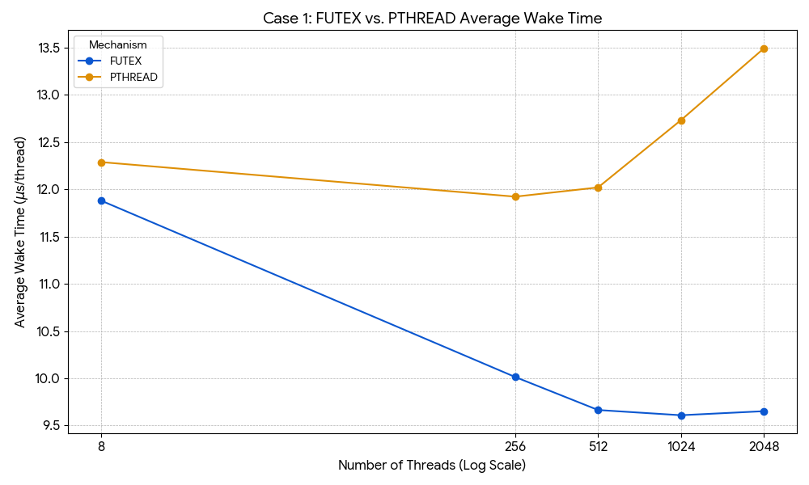
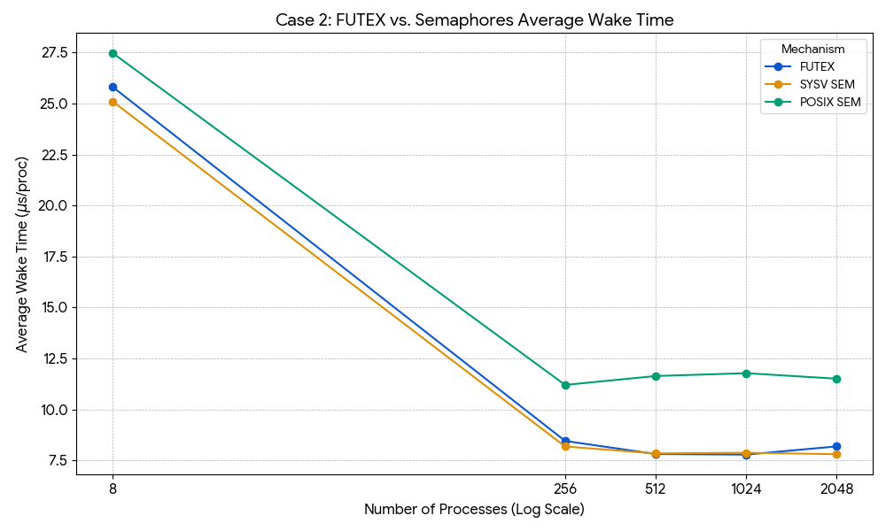

## futex vs pthread vs semaphore Benchmark

Threads: 8: 
[FUTEX] Average wake time: 11.8795 us/thread
[PTHREAD] Average wake time: 12.2869 us/thread 
Threads: 256
[FUTEX] Average wake time: 10.0135 us/thread
[PTHREAD] Average wake time: 11.9214 us/thread 
Threads: 512
[FUTEX] Average wake time: 9.66456 us/thread 
[PTHREAD] Average wake time: 12.019 us/thread
Threads: 1024
[FUTEX] Average wake time: 9.60938 us/thread 
[PTHREAD] Average wake time: 12.7301 us/thread 
Threads: 2048
[FUTEX] Average wake time: 9.65207 us/thread 
[PTHREAD] Average wake time: 13.4884 us/thread

Processes: 8
[FUTEX]   Average wake time: 25.8062 us/proc 
[SYSV SEM] Average wake time: 25.095 us/proc
[POSIX SEM] Average wake time: 27.4666 us/proc
Processes: 256
[FUTEX]   Average wake time: 8.45731 us/proc 
[SYSV SEM] Average wake time: 8.18596 us/proc 
[POSIX SEM] Average wake time: 11.2026 us/proc 
Processes: 512
[FUTEX]   Average wake time: 7.81535 us/proc 
[SYSV SEM] Average wake time: 7.84637 us/proc 
[POSIX SEM] Average wake time: 11.6396 us/proc
Processes: 1024
[FUTEX]   Average wake time: 7.78773 us/proc
[SYSV SEM] Average wake time: 7.87728 us/proc
[POSIX SEM] Average wake time: 11.7787 us/proc
Processes: 2048
[FUTEX]   Average wake time: 8.18916 us/proc 
[SYSV SEM] Average wake time: 7.80784 us/proc 
[POSIX SEM] Average wake time: 11.5098 us/proc
