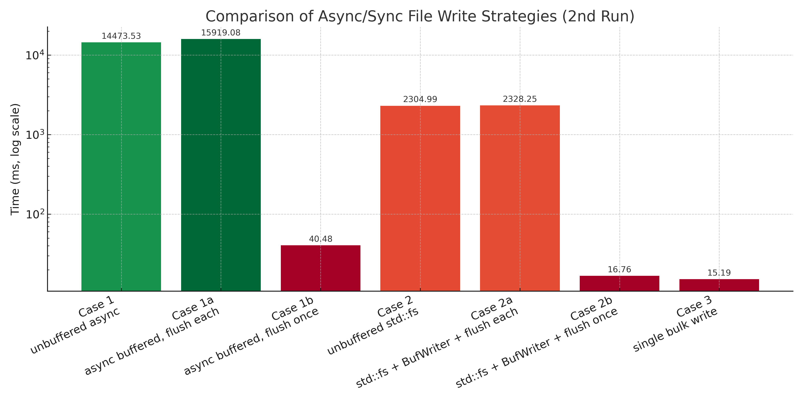

## Async vs Sync File Write Benchmark

| Case | Description                              | Time (ms)    |
|------|------------------------------------------|--------------|
| 1    | Unbuffered async                         | 14473.527 ms |
| 1a   | Async buffered, flush each               | 15919.082 ms |
| 1b   | Async buffered, flush once               | 40.476 ms    |
| 2    | Unbuffered std::fs                       | 2304.986 ms  |
| 2a   | std::fs + BufWriter, flush each          | 2328.247 ms  |
| 2b   | std::fs + BufWriter, flush once          | 16.756 ms    |
| 3    | Single bulk write                        | 15.188 ms    |
